# <center><h1 align="center"> findPAWS Engage 2022  </h1></center>
### <center><p align="center"><i>A face recognition app to locate the potential dog owners of the lost dogs.</i></p></center>

<br> 

## Table of Contents

1. [About the project](#about-the-project)
   - [Salient features](#salient-features)
2. [Technology Stack](#technology-stack)
3. [Compatibility](#compatibility)
4. [Tour through the App](#tour-through-the-app)
   - [Initial Screens: Login and Sign up](#-initial-screens-login-and-sign-up)
   - [Adding pet dogs to the app](#-adding-pet-dogs-to-the-app)
   - [Home Screen features](#-home-screen-features)
   - [Marking the pet dog as lost](#-marking-the-pet-dog-as-lost-)
   - [Found pet functionality](#-found-pet-functionality)
5. [Flow of the app](#flow-of-the-app)
6. [Implementation of Agile Methodology](#implementation-of-agile-methodology)
7. [Installation](#installation)
8. [Special Instructions to Work with the App](#special-instructions-to-work-with-the-app)
9. [Challenges Faced](#challenges-faced)
10. [Future Scope](#future-scope)
11. [Support and Contact](#future-scope)


## About the project

- The project findPAWS is an ***Android Mobile Application built using Flutter*** for Microsoft Engage 2022 by implementing the Agile Methodology.

- The purpose of the app is to locate the potential dog owners of the lost dogs through email enclosing the contact details of the finder.

- The app uses both, Face Recognition technology and Realtime Location to give the most accurate result.

[(Back to the top)](#-findpaws-engage-2022--)

### Salient Features


 #### Specific to the dog owners
- Login and Register features implemented through Firebase authentication.
- The breeds of the dogs is identified by the tflite model and the owner can choose among them, and also specify any other breed in case, the breed is not present in the list.
- The app securely allows to proceed only if it detects the image of a dog. In case of any wrong upload, it prompts the user to try again. In case, the image is of a cat, the cat is detected and the user is asked to upload the image of a dog.
- The pet parents can add new pet dogs, delete pets and also edit information about their current pet.
- The app also displays the pets that are missing within the 50km radius of the user.
- The pet owners need to provide their current location in case to register their dog as lost.

> (*Note: I have assumed that the pet is lost near the current location of the owner. I could not implement the functionality that could allow to the owners to provide an exact location on the Google Maps other than the current location, because this is a paid feature of Google Cloud APIs and requires billing.*)


#### Specific to the finders
- The finders can directly click image from their phones on the spot to check the breed of the found dog.
- The current location of the finder is taken and the application displays the list of all the pet parents within 50km radius of the same breed. The finder can then contact the probable owners in a single click by sharing his details with the owners.
- The Email sent to the pet parent consists of the contact details of the finder along with a url of image of the found dog.

#### Key points:
- The application uses two tflite models.
- The first tflite model is trained to identify 120 breeds of dogs.
- Another tflite model verifies that the image does not show a cat, since certain breeds of cats and dogs look similar when clicked from certain angles.
- The app can detect whether the uploaded image resembles a cat and displays a separate alert box saying that the user has uploaded the image of a cat and he/she needs to upload the image of a dog.
- Several checks, necessary alerts and loading screens have been implemented to give a better user experience and prevent inconsistency of data in the database.

[(Back to the top)](#-findpaws-engage-2022--)

## Technology Stack

<p align="center">
<span>


</span>
  </p>

<br>

- Flutter and Dart were used to develop the application.
- Necessary packages were imported from pub.dev.
- The backend has been implemented using Firebase. (Firebase authentication, Firestore and Firebase Storage have been used).
- The models for Face Recognition have been implemented using tflite.
- The locations have been fetched using Google Maps API.
- GeoFlutterFire has been used to query records within a 50km radius of the current location.
- The email service has been implemented using EmailJS. 

[(Back to the top)](#-findpaws-engage-2022--)


## Compatibility

The flutter application is compatible to run on android smart phones.

[(Back to the top)](#-findpaws-engage-2022--)


## Tour through the App
- <h3> Initial Screens: Login and Sign up</h3>
<p align="left">
   <figure style="padding-right: 20px;" >
  <kbd>
   <div><figcaption> <p align="center" style="font-size:100px"> Splash Screen</p></figcaption></div>
     </figure>&nbsp;&nbsp;&nbsp;&nbsp;&nbsp;&nbsp;
  <figure>
  <kbd>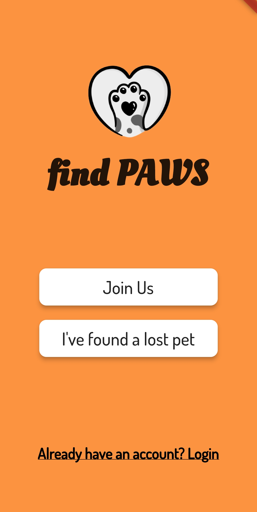
   <div><figcaption> <p align="center" style="font-size:100px"> Welcome Screen</p></figcaption></div>
     </figure>&nbsp;&nbsp;&nbsp;&nbsp;&nbsp;&nbsp;
   <figure>
  <kbd>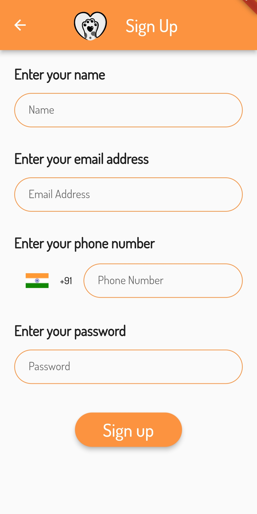
   <div><figcaption> <p align="center" style="font-size:100px"> Join Us Screen</p></figcaption></div>
     </figure>&nbsp;&nbsp;&nbsp;&nbsp;&nbsp;&nbsp;
    <figure>
  <kbd>
   <div><figcaption> <p align="center" style="font-size:100px"> Login In Screen</p></figcaption></div>
     </figure>&nbsp;&nbsp;&nbsp;&nbsp;&nbsp;&nbsp;
</p>
<hr>
    
- <h3> Adding pet dogs to the app</h3>
<p align="left">
   <figure style="padding-right: 20px;" >
  <kbd>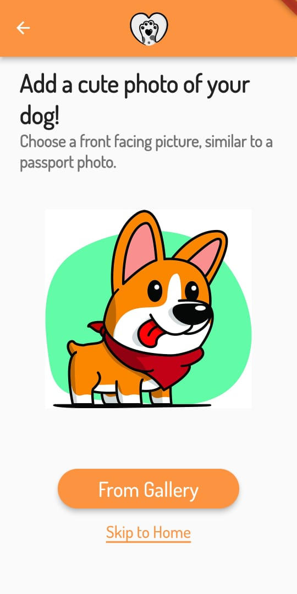
   <div><figcaption> <p align="center" style="font-size:100px"> Upload Image of the dog</p></figcaption></div>
     </figure>&nbsp;&nbsp;&nbsp;&nbsp;&nbsp;&nbsp;
  <figure>
  <kbd>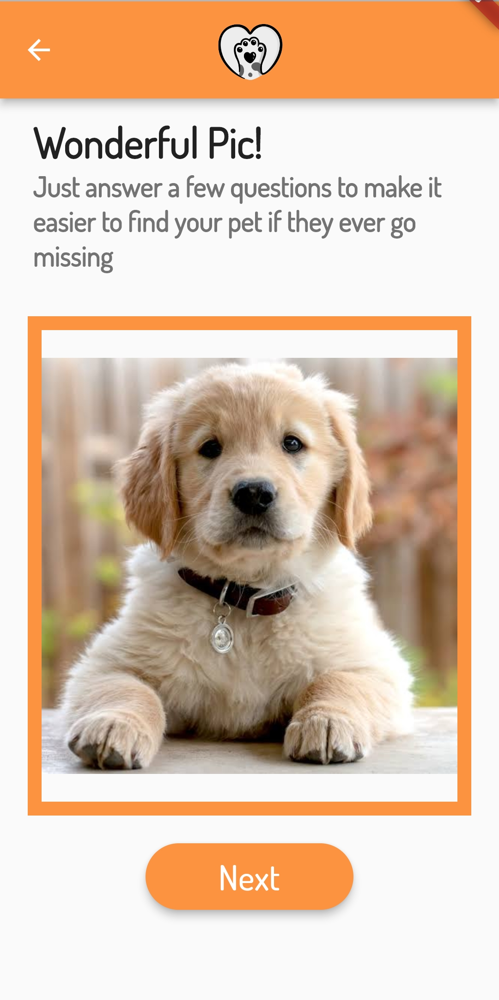
   <div><figcaption> <p align="center" style="font-size:100px"> Image uploaded </p></figcaption></div>
     </figure>&nbsp;&nbsp;&nbsp;&nbsp;&nbsp;&nbsp;
   <figure>
  <kbd>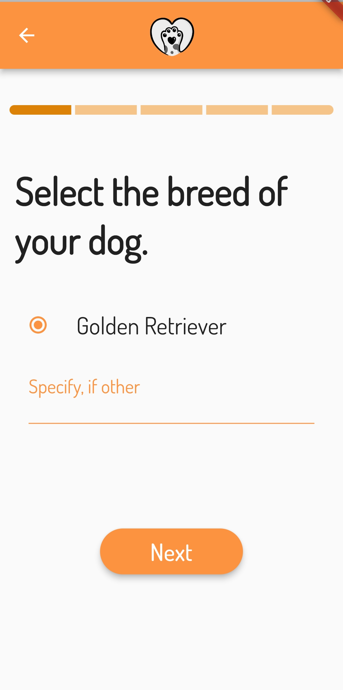
   <div><figcaption> <p align="center" style="font-size:100px"> List of determined breeds </p></figcaption></div>
     </figure>&nbsp;&nbsp;&nbsp;&nbsp;&nbsp;&nbsp;
    <figure>
  <kbd>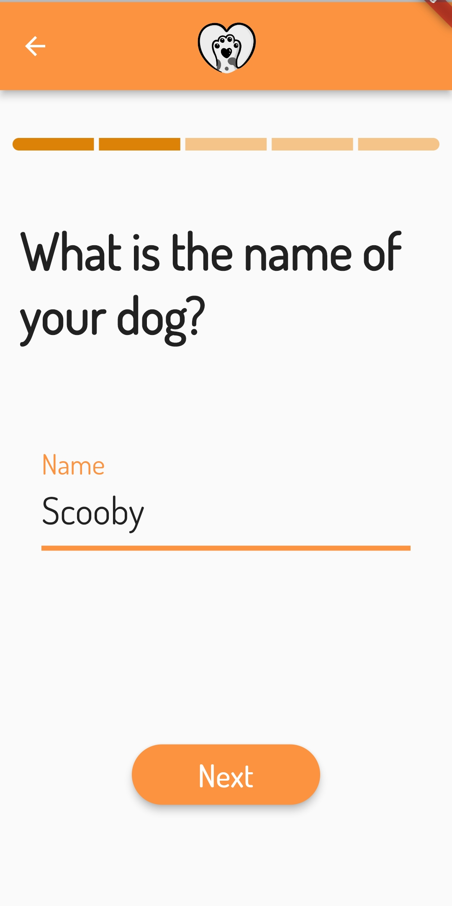
   <div><figcaption> <p align="center" style="font-size:100px"> Enter the name</p></figcaption></div>
     </figure>
 </p>    
      <figure>
  <kbd>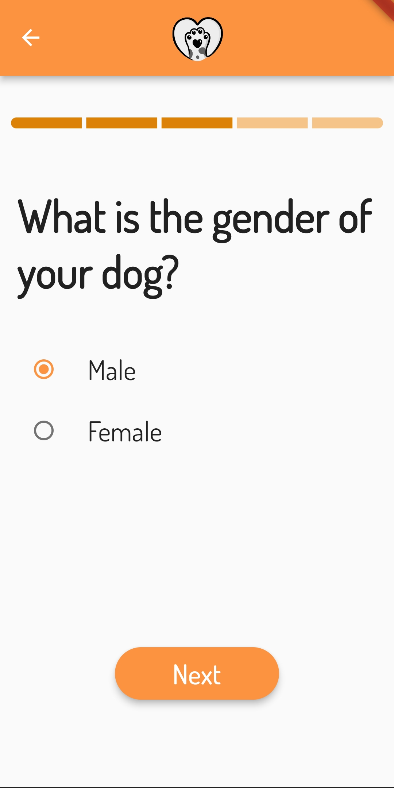
   <div><figcaption> <p align="center" style="font-size:100px"> Select the gender </p></figcaption></div>
     </figure>&nbsp;&nbsp;&nbsp;&nbsp;&nbsp;&nbsp;
        <figure>
  <kbd>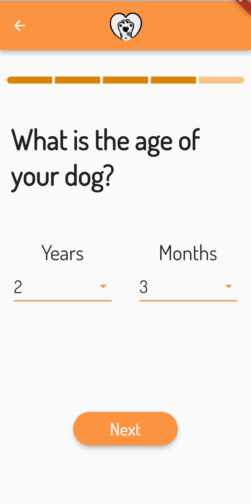
   <div><figcaption> <p align="center" style="font-size:100px"> Select the age </p></figcaption></div>
     </figure>&nbsp;&nbsp;&nbsp;&nbsp;&nbsp;&nbsp;
          <figure>
  <kbd>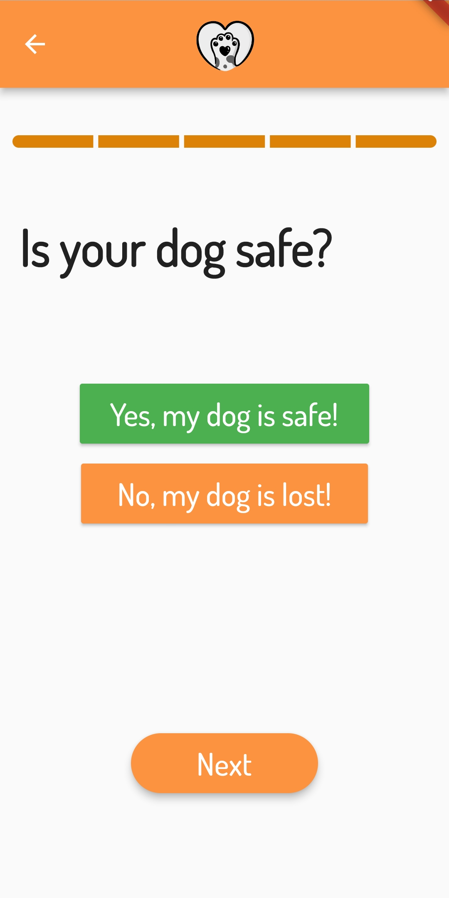
   <div><figcaption> <p align="center" style="font-size:100px"> Status of safety </p></figcaption></div>
     </figure>&nbsp;&nbsp;&nbsp;&nbsp;&nbsp;&nbsp;

<hr>
           
- <h3> Home Screen features</h3>
<p align="left">
   <figure style="padding-right: 20px;" >
  <kbd>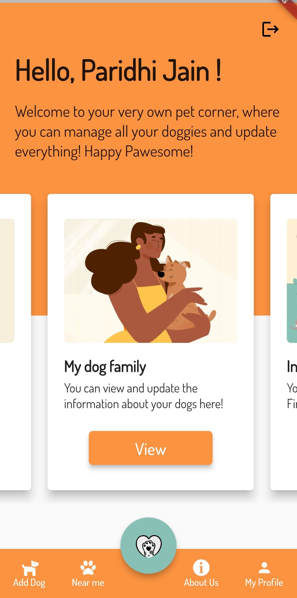
   <div><figcaption> <p align="center" style="font-size:100px"> Home Screen of the app</p></figcaption></div>
     </figure>&nbsp;&nbsp;&nbsp;&nbsp;&nbsp;&nbsp;
  <figure>
  <kbd>
   <div><figcaption> <p align="center" style="font-size:100px"> User profile edit </p></figcaption></div>
     </figure>&nbsp;&nbsp;&nbsp;&nbsp;&nbsp;&nbsp;
   <figure>
  <kbd>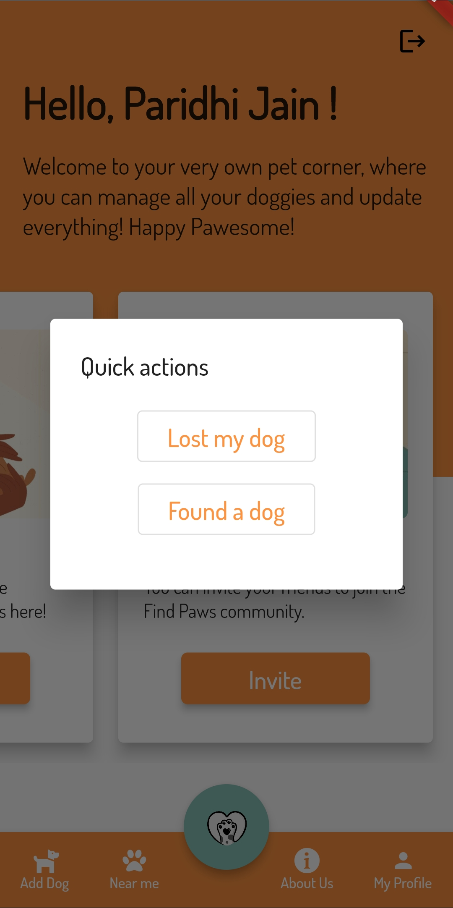
   <div><figcaption> <p align="center" style="font-size:100px">Quick options</p></figcaption></div>
     </figure>&nbsp;&nbsp;&nbsp;&nbsp;&nbsp;&nbsp;
    <figure>
  <kbd>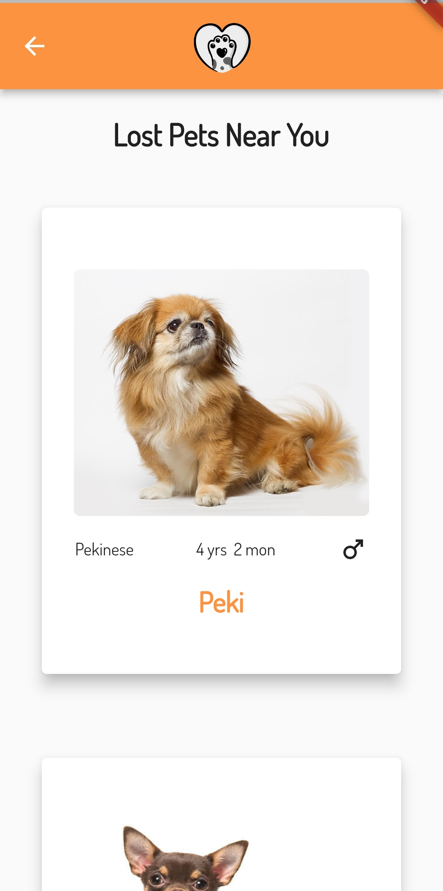
   <div><figcaption> <p align="center" style="font-size:100px"> Lost pets near me</p></figcaption></div>
     </figure>
 </p> 
  <figure>
  <kbd>
   <div><figcaption> <p align="center" style="font-size:100px"> About findPAWS</p></figcaption></div>
     </figure>&nbsp;&nbsp;&nbsp;&nbsp;&nbsp;&nbsp;
        <figure>
  <kbd>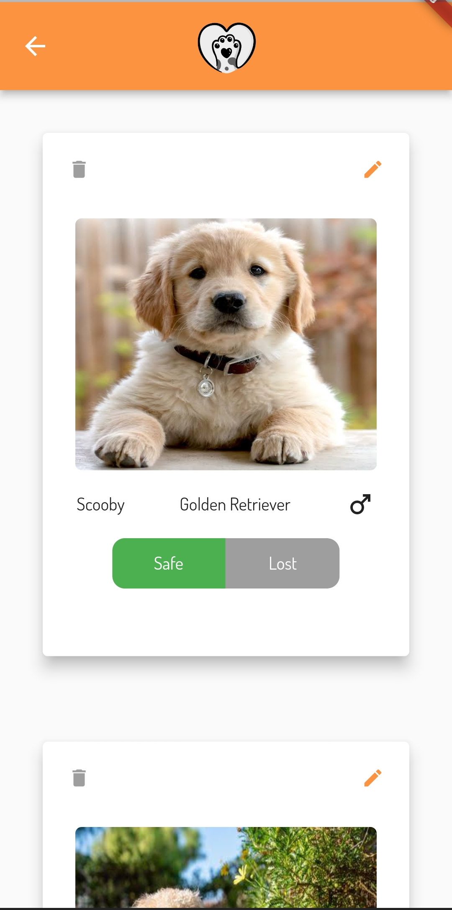
   <div><figcaption> <p align="center" style="font-size:100px">My dog family</p></figcaption></div>
     </figure>&nbsp;&nbsp;&nbsp;&nbsp;&nbsp;&nbsp;
          <figure>
  <kbd>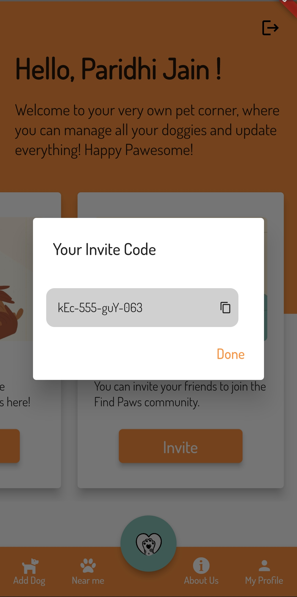
   <div><figcaption> <p align="center" style="font-size:100px">Code for invite </p></figcaption></div>
     </figure>&nbsp;&nbsp;&nbsp;&nbsp;&nbsp;&nbsp;
<hr>

- <h3> Marking the pet dog as lost </h3>
<p align="left">
   <figure style="padding-right: 20px;" >
  <kbd>
   <div><figcaption> <p align="center" style="font-size:100px"> Initial Message</p></figcaption></div>
     </figure>&nbsp;&nbsp;&nbsp;&nbsp;&nbsp;&nbsp;
  <figure>
  <kbd>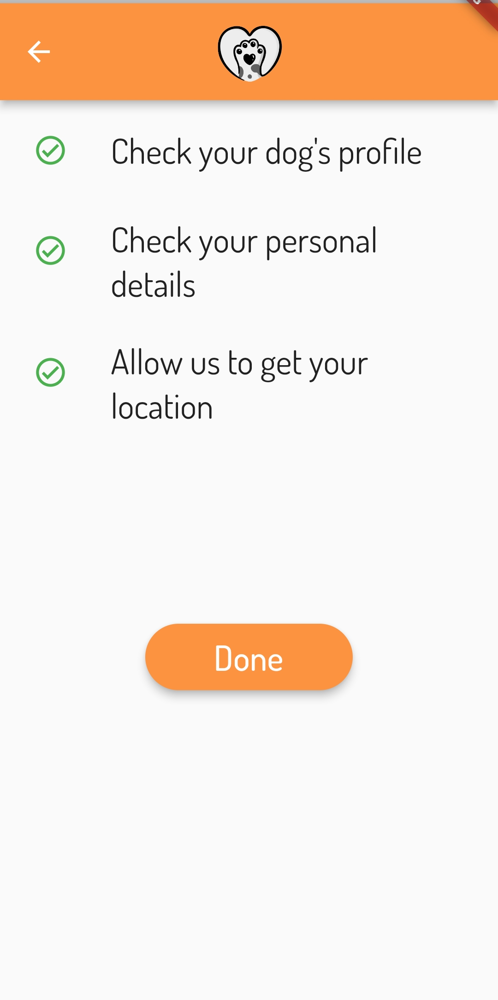
   <div><figcaption> <p align="center" style="font-size:100px"> Owner check list</p></figcaption></div>
     </figure>&nbsp;&nbsp;&nbsp;&nbsp;&nbsp;&nbsp;
   <figure>
  <kbd>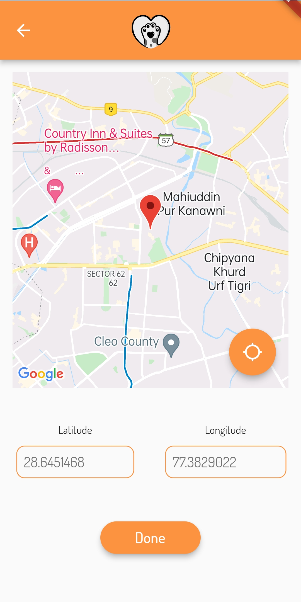
   <div><figcaption> <p align="center" style="font-size:100px">Fetching user location</p></figcaption></div>
     </figure>&nbsp;&nbsp;&nbsp;&nbsp;&nbsp;&nbsp;
    <figure>
  <kbd>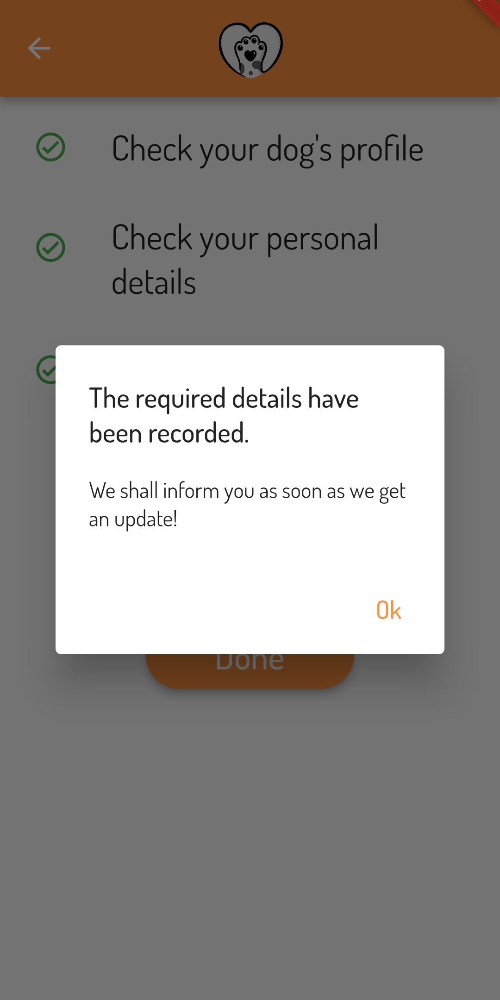
   <div><figcaption> <p align="center" style="font-size:100px"> Confirmation</p></figcaption></div>
     </figure>
 </p>
    
<hr>
  
- <h3> Found pet functionality</h3>
<p align="left">
   <figure style="padding-right: 20px;" >
  <kbd>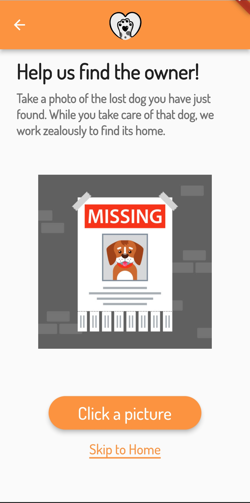
   <div><figcaption> <p align="center" style="font-size:100px">Upload image of found dog</p></figcaption></div>
     </figure>&nbsp;&nbsp;&nbsp;&nbsp;&nbsp;&nbsp;
  <figure>
  <kbd>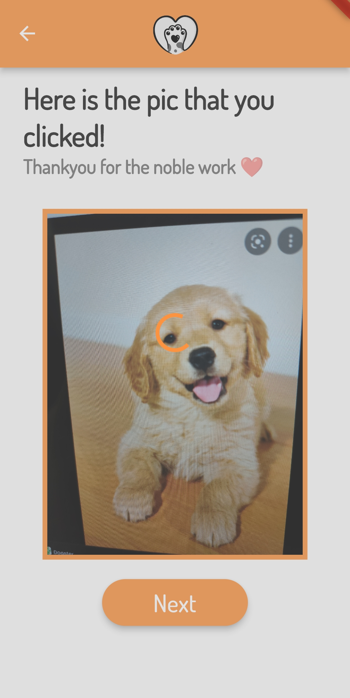
   <div><figcaption> <p align="center" style="font-size:100px"> Determining breed</p></figcaption></div>
     </figure>&nbsp;&nbsp;&nbsp;&nbsp;&nbsp;&nbsp;
   <figure>
  <kbd>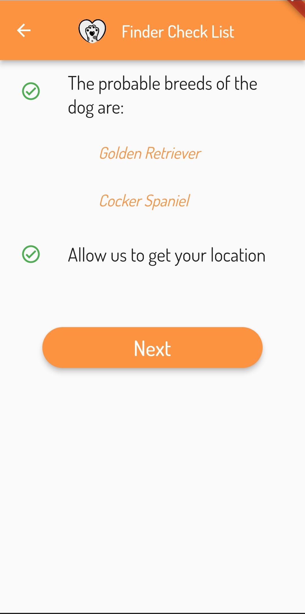
   <div><figcaption> <p align="center" style="font-size:100px">Finder check list</p></figcaption></div>
     </figure>&nbsp;&nbsp;&nbsp;&nbsp;&nbsp;&nbsp;
    <figure>
  <kbd>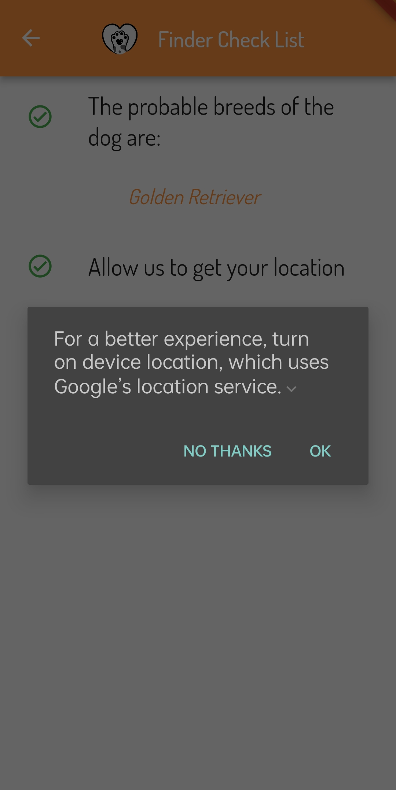
   <div><figcaption> <p align="center" style="font-size:100px">Fetching finder location</p></figcaption></div>
     </figure>
 </p> 
  <figure>
  <kbd>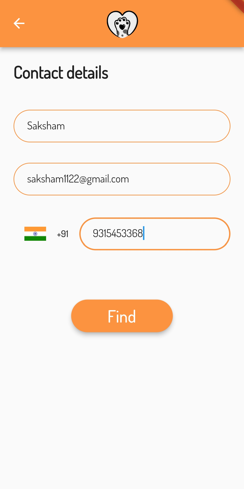
   <div><figcaption> <p align="center" style="font-size:100px"> Collecting finder details</p></figcaption></div>
     </figure>&nbsp;&nbsp;&nbsp;&nbsp;&nbsp;&nbsp;
        <figure>
  <kbd>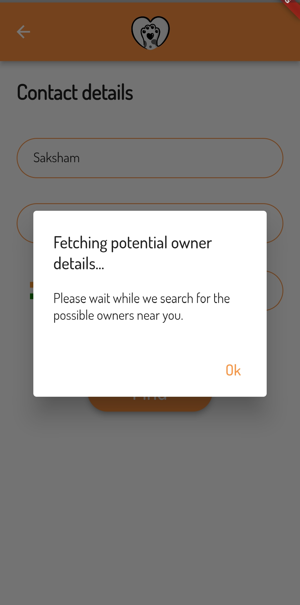
   <div><figcaption> <p align="center" style="font-size:100px">Fetching probable owners</p></figcaption></div>
     </figure>&nbsp;&nbsp;&nbsp;&nbsp;&nbsp;&nbsp;
    <figure>
  <kbd>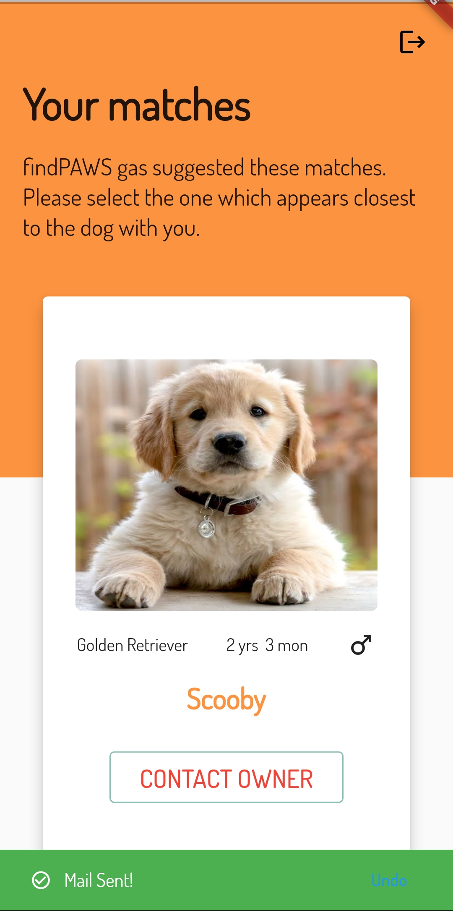
   <div><figcaption> <p align="center" style="font-size:100px">Sending mail</p></figcaption></div>
     </figure>&nbsp;&nbsp;&nbsp;&nbsp;&nbsp;&nbsp;
     <figure>
    <kbd>
   <div><figcaption> <p align="center" style="font-size:100px">Recieved mail</p></figcaption></div>
     </figure></kbd>&nbsp;&nbsp;&nbsp;&nbsp;&nbsp;&nbsp;
      </p>   
 <br>
    
If no possible pet parent is found,
      
   <figure style="padding-right: 20px;" >
  <kbd>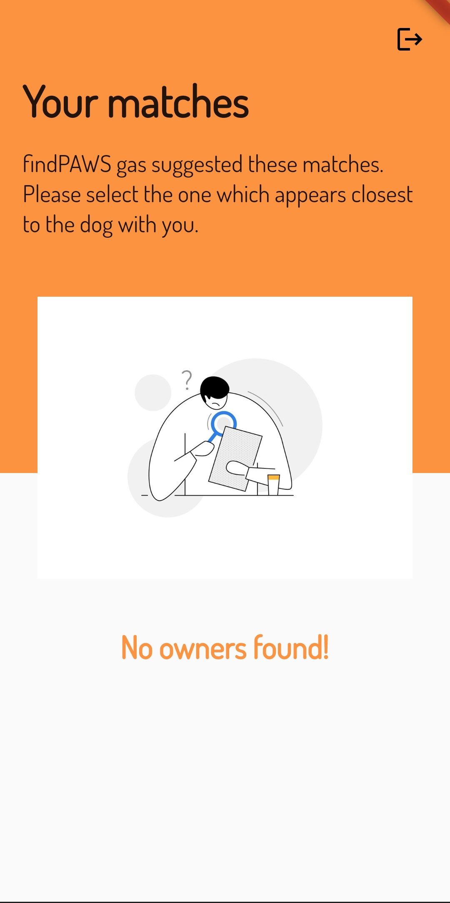
   <div><figcaption> <p align="center" style="font-size:100px"> If no owners found</p></figcaption></div>
     </figure>&nbsp;&nbsp;&nbsp;&nbsp;&nbsp;&nbsp;

     
<hr>
    
[(Back to the top)](#-findpaws-engage-2022--)
    
    
## Flow of the App
<p align="center">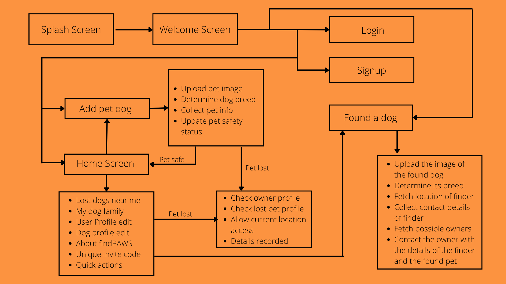</p>

[(Back to the top)](#-findpaws-engage-2022--)
    
    
## Implementation of Agile Methodology

### What is Agile?
Agile is a development methodology adopted today in the software industry. Agile promotes teamwork, flexible procedures, and sle-organizing teams.

### How I incorporated Agile Methodology during the development cycle?
SCRUM is a subset of Agile, a framework for developing software.The basic time working unit is the sprint. SCRUM teams always reason in sprints and their planning is limited to sprints.

- Sprint 1: **Research and Design** : Researching about ways to accomplish face recognition and dogs. Finding ways to query documents from firebase based on location. Exploring more about firestore and firebase storage. Designing the app theme and layout and wireframing the overall appearance, Planning out how the different functionalities would be embedded on different screens and the order in which they would be implemented.

- Sprint 2: **Building the application** : Divided the app into two interfaces: owner and finder. Built and coded the core of the application including all the functionalities separately for both the interfaces.Ensured data consistency in the database. Encountered bugs which were either fixed by reading through stack overflow and documentations or alternative implementations were found for the same. The UI was taken care of throughout the process so that the user experience is not compromised during the implementation of the functionalities. Later, when both the interfaces were complete the navigation routes were set up so as to link the interfaces properly.

- Sprint 3: **Testing and debugging** : Tested the app and fixed all the bugs. Tested it from user point of view and implemented minor additional features that could improve the experience. This also included the implementation of alert boxes, loading screens and snackbars.


    
    
### How it helped me?

- It made the app development process more efficient and predictable.
- I worked on functionalities looking at them as smaller units of the larger app due to which the process was easy to handle, flexible and allowed more room to adjust new functionalities.

[(Back to the top)](#-findpaws-engage-2022--)
    

## Installation

Initialise git on your terminal:
```
git init
```
<br>

Clone this repository:
``` 
git clone https://github.com/Paridhicodes/FindPaws.git
```
<br>

Change the directory.
```
cd FindPaws/
```
      
<br>
      
      
Run the ```packages get``` command in your project directory:

```
flutter pub get
```

<br>

Once the build is complete, run the ```run``` command to start the app:

```
flutter run
```

[(Back to the top)](#-findpaws-engage-2022--)
    
## Special Instructions to Work with the App


1. The application can only be run on android physical devices. Due to the app being heavy, it would not work on virtual emulators.

2. Depending on the kind of predictions made by the models, different alerts are prompted. The app allows to proceed when it is confirmed that it is the image of a dog that belongs to a certain breed after careful examination.

3. In case the app prompts to upload a clear image of a dog, please ensure proper lighting in the image.

4. Certain breeds of dogs possess prominent features of cats. Hence, from certain angles the model predicts the animal to be cat. In such cases, try changing the angle of the camera and the distance from which the image is clicked.

[(Back to the top)](#-findpaws-engage-2022--)

## Challenges Faced
1. The major challenge was recognizing and matching the faces of dogs. Though, there are a lot a APIs that support human face recognition, none of them clearly mentions about face recognition and face matching in animals.
   - *Therefore, I decided to implement tflite models inorder to predict the breeds of the dogs, since, dogs of same breed look almost same. Then, I decided to incorporate the feature of fetching locations of both finders and owners to give more accurate results. Moreover, when the probable owners of the pets are displayed to the finders, the age, image and other information of the lost dogs is also displayed. So, the finder being the eye witness may contact only those owners whose lost dogs resemble the found dog the most based on the additional information.*

2. Another challenge was to fetch the records having information of all the dogs that have been marked missng within a 50km radius. Doing manual calculations on latitude and longitude would compromise with the efficiency and performance of the app.
   - *After a lot of research, I came across GeoFlutterFire, an open-source library that allows you to store and query a set of keys based on their geographic location. It uses geopoints and geohash to selectively load only the data near certain locations, keeping your applications light and responsive, even with extremely large datasets.*

[(Back to the top)](#-findpaws-engage-2022--)
    
## Future Scope
- The models could be trained on larger data sets supporting more number of breeds of dogs.
- A discussion forum can be established for pet parents where they can discuss about common pet issues.
- If billing is enabled, then the last known location of dog can be fetched by searching through the map in realtime. Presently, it is assumed that the dog is lost near the current location of the parent.
- I have already included a section to generate a unique invite code in the app. An invite and earn feature can also be implemented combined with the unique code generation feature.

[(Back to the top)](#-findpaws-engage-2022--)
    
## Support and Contact

Email to: paridhijain0201@gmail.com
    
    
[(Back to the top)](#-findpaws-engage-2022--)
    
